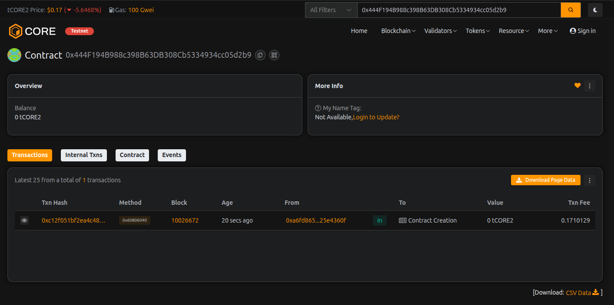

# SecureSwap DEX

---

## Project Description

SecureSwap DEX is a decentralized exchange (DEX) built on Ethereum blockchain using Solidity smart contracts. It provides a secure, transparent, and permissionless platform for users to swap tokens, provide liquidity, and earn trading fees. The platform implements an automated market maker (AMM) mechanism to facilitate token swaps without the need for traditional order books.

The smart contract includes comprehensive features such as liquidity management, token swapping with customizable fees, multi-token support, and administrative controls. SecureSwap DEX ensures security through rigorous validation checks and access control mechanisms.

---

## Project Vision

Our vision is to create a truly decentralized, secure, and user-friendly exchange platform that empowers users with complete control over their assets. We aim to:

- **Democratize Finance**: Enable anyone to trade digital assets without intermediaries
- **Enhance Security**: Implement robust smart contract security practices to protect user funds
- **Foster Liquidity**: Incentivize liquidity providers to ensure smooth trading experiences
- **Promote Transparency**: Maintain complete transparency in all transactions and fee structures
- **Drive Innovation**: Continuously evolve with cutting-edge DeFi mechanisms and features

SecureSwap DEX strives to be a cornerstone in the decentralized finance ecosystem, providing a reliable and efficient platform for digital asset exchange.

---

## Key Features

### Core Functionality
- **Liquidity Management**: Users can add and remove liquidity to earn trading fees
- **Token Swapping**: Automated market maker (AMM) based token swaps with low fees
- **Multi-Token Support**: Flexible architecture supporting multiple ERC-20 tokens
- **Deposit & Withdrawal**: Secure token deposit and withdrawal mechanisms

### Security Features
- **Access Control**: Owner-only functions for critical operations
- **Input Validation**: Comprehensive validation for all user inputs
- **Token Whitelisting**: Only approved tokens can be traded on the platform
- **Event Logging**: Complete transaction history through event emissions

### Administrative Controls
- **Fee Management**: Adjustable trading fees (capped at 10%)
- **Token Management**: Add or remove supported tokens
- **Ownership Transfer**: Secure ownership transfer mechanism
- **Balance Queries**: Real-time balance checking for users

### Technical Highlights
- Built with Solidity ^0.8.0
- Gas-optimized operations
- Modular and upgradeable architecture
- Comprehensive event system for frontend integration
- Fallback function for direct ETH deposits

---

## Future Scope

### Phase 1: Enhanced Features
- **Liquidity Pools**: Implement individual liquidity pools for each token pair
- **Yield Farming**: Introduce staking mechanisms for liquidity providers
- **Governance Token**: Launch native governance token for community voting
- **Advanced AMM**: Integrate concentrated liquidity and multi-hop swaps

### Phase 2: Cross-Chain Integration
- **Bridge Support**: Enable cross-chain token swaps
- **Multi-Chain Deployment**: Deploy on multiple EVM-compatible chains
- **Layer 2 Integration**: Implement Layer 2 solutions for reduced gas fees

### Phase 3: Advanced DeFi Features
- **Lending & Borrowing**: Add lending protocol integration
- **Perpetual Swaps**: Introduce derivatives trading
- **Limit Orders**: Implement decentralized limit order functionality
- **Flash Loans**: Enable flash loan capabilities for arbitrage

### Phase 4: User Experience
- **Mobile Application**: Develop native mobile apps
- **Fiat On-Ramp**: Integrate fiat currency gateways
- **Advanced Analytics**: Provide comprehensive trading analytics and charts
- **Social Trading**: Enable copy trading and social features

### Phase 5: Security & Compliance
- **Multi-Signature Wallet**: Implement multi-sig for contract upgrades
- **Insurance Fund**: Create an insurance mechanism for user protection
- **Audit Program**: Regular third-party security audits
- **KYC/AML Integration**: Optional compliance features for institutional users

---

## Contract Details:

Transaction id: 0x444F194B988c398B63DB308Cb5334934cc05d2b9
